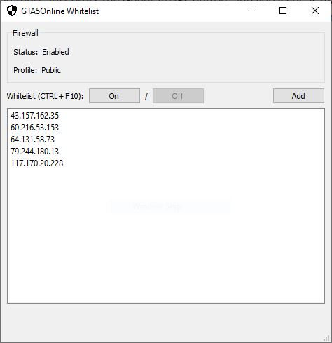

  

# GTA5Online_Whitelist
A tool used to setup a private lobby in GTAV by whitelisting IPs within the Windows Firewall.

### Requirements
- npcap - https://nmap.org/npcap/
- Visual C++ (64 bit) - https://support.microsoft.com/en-sg/help/2977003/the-latest-supported-visual-c-downloads

### Notes
- This program requires administrative rights to add/remove rules from the firewall
- The Inbound and Outbound rules created are grouped under "GTA5Online_Whitelist"
